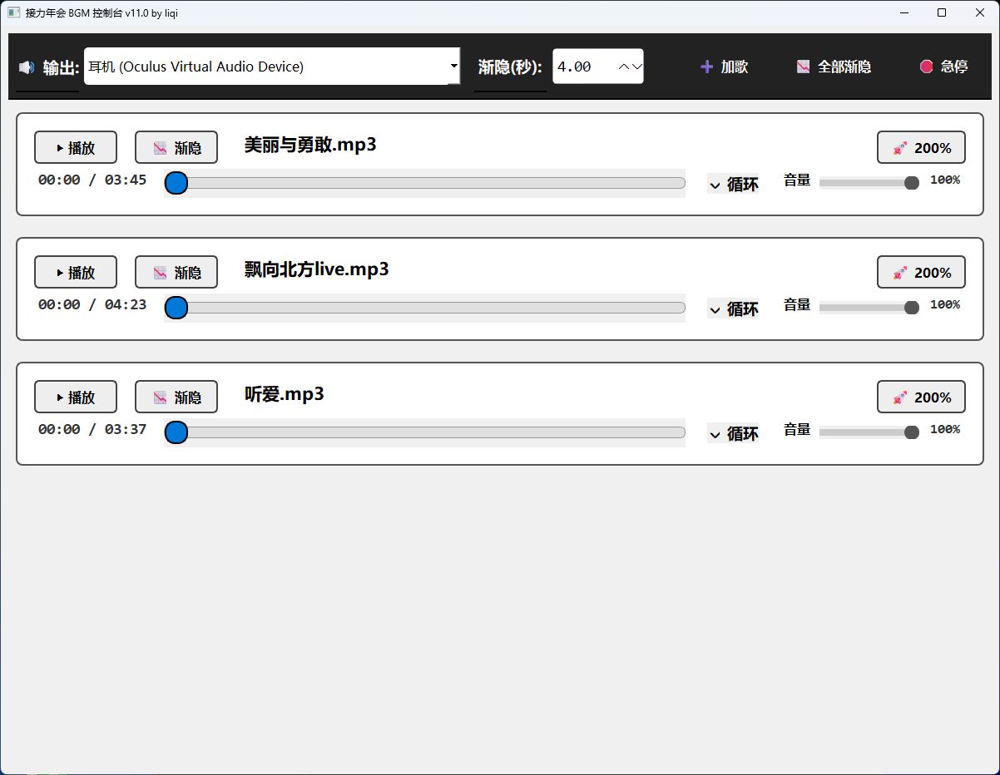

# EasyPlayer - 专业的现场 BGM 音频控制器


## 📖 简介 | Introduction

**EasyPlayer** 是一款专为年会、现场活动、舞台演出设计的轻量级 BGM 音频播放控制软件。它基于 PyQt6 开发，旨在为音控师提供稳定、直观、高效的音频管理体验。

告别复杂的专业播放软件，EasyPlayer 让你在活动现场轻松应对各种突发状况，一键淡入淡出，无缝切换背景音乐。

## ✨ 核心功能 | Features

- **🎹 多轨并行控制**：支持同时加载多首音乐，独立控制每一轨的播放、暂停和循环。
- **📉 平滑淡出 (Fade Out)**：一键执行平滑淡出并暂停，杜绝生硬切歌，提升现场专业感。渐隐时长可自定义（0.5s - 10s）。
- **🚀 200% 音量增益 (Boost)**：*（需 FFmpeg）* 遇到原曲音量过小的情况？内置增益功能可生成 200% 音量的新文件，无需打开音频编辑软件即可救急。
- **🔊 多输出设备切换**：支持实时切换音频输出设备（主音箱/耳机），满足现场监听需求。
- **🛑 紧急停止 (Kill Switch)**：一键停止所有播放，应对紧急情况。
- **💾 自动状态记忆**：自动保存你的设置（音量、循环状态、加载的歌曲），下次打开即可直接使用。
- **🪟 Windows 优化**：深度优化 Windows 下的子进程调用，隐藏 FFmpeg 黑框，界面清爽无干扰。

## 🛠️ 安装与运行 | Installation

### 方式一：直接运行 (推荐开发者)

1. **克隆项目**
   ```bash
   git clone https://github.com/your-username/easy-player.git
   cd easy-player
   ```

2. **安装依赖**
   ```bash
   pip install -r requirements.txt
   ```

3. **运行**
   ```bash
   python main.py
   ```

### 方式二：下载可执行文件 (对于普通用户)
请前往 [Releases](https://github.com/your-username/easy-player/releases) 页面下载最新版本的 `EasyPlayer.exe`。无需安装 Python 即可运行。

## 🔌 关于 FFmpeg (重要) | About FFmpeg

为了使用 **"🚀 200% 增益"** 功能，你需要安装 FFmpeg：

1. 下载 `ffmpeg.exe` 和 `ffprobe.exe` (推荐从 [gyan.dev](https://www.gyan.dev/ffmpeg/builds/) 下载 release-essentials)。
2. 将这两个文件放到 EasyPlayer 的根目录下。
3. 重启软件，增益按钮即可点亮使用。

> *如果没有 FFmpeg，播放、淡出等基础功能不受影响，仅增益功能不可用。*

## 📦 如何打包 (Build) | Building

如果你想自己打包 exe 文件，可以使用我们提供的脚本：

1. 确保已安装依赖：
   ```bash
   pip install pyinstaller
   ```
2. 运行打包脚本：
   - **Windows**: 双击运行 `build_exe.bat`

打包完成后，单文件可执行程序将位于 `dist/EasyPlayer.exe`。

## 📸 截图 | Screenshots



## 📄 许可证 | License

MIT License. 欢迎 Fork 和 PR！

---
Designed with ❤️ for events.
